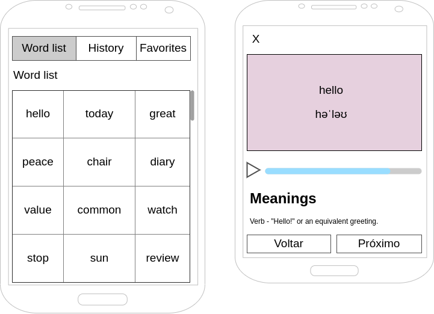

# Portuguese Version

## Aplicativo de Dicionário Inglês

> Um aplicativo móvel para explorar palavras em inglês, suas definições e pronúncias com favoritos e histórico de visualização.

## Funcionalidades

- Navegue por uma lista abrangente de palavras em inglês com rolagem infinita
- Pesquise palavras específicas
- Visualize definições detalhadas de palavras, fonética e exemplos
- Ouça pronúncias de palavras
- Salve palavras favoritas para acesso rápido
- Acompanhe o histórico de visualização de palavras
- Autenticação de usuário para sincronizar favoritos e histórico entre dispositivos

## Capturas de Tela

<div style="display: flex; flex-wrap: wrap; justify-content: space-around; gap: 10px;">
  
  
  
  
  
</div>

## Tecnologias Utilizadas

- **React Native** - Framework de aplicativo móvel
- **Expo** - Plataforma de desenvolvimento para React Native
- **TypeScript** - JavaScript com tipagem segura
- **React Navigation** - Biblioteca de navegação para React Native
- **Expo AV** - Reprodução de áudio para pronúncias de palavras
- **AsyncStorage** - Armazenamento local para cache e persistência
- **Context API** - Gerenciamento de estado
- **Free Dictionary API** - Definições e fonética de palavras

## Estrutura do Projeto

```plaintext
├── assets/                # Ícones e imagens do aplicativo
├── src/
│   ├── components/        # Componentes de UI reutilizáveis
│   │   ├── LoadingIndicator.tsx
│   │   ├── SearchBar.tsx
│   │   └── WordCard.tsx
│   ├── contexts/          # Gerenciamento de estado da aplicação
│   │   └── AppContext.tsx
│   ├── navigation/        # Configuração de navegação
│   │   └── types.ts
│   ├── screens/           # Telas da aplicação
│   │   ├── FavoritesScreen.tsx
│   │   ├── HistoryScreen.tsx
│   │   ├── HomeScreen.tsx
│   │   ├── LoginScreen.tsx
│   │   └── WordDetailsScreen.tsx
│   ├── services/          # Serviços de API e dados
│   │   ├── api.ts         # Integração com API de dicionário
│   │   ├── storage.ts     # Gerenciamento de armazenamento local
│   │   └── words.ts       # Gerenciamento do dicionário de palavras
│   └── theme/             # Estilização e temas do aplicativo
│       └── index.ts
├── App.tsx               # Componente principal da aplicação
└── index.ts              # Ponto de entrada
```

## Instalação

1. Clone o repositório

```bash
git clone https://github.com/yourusername/english-dictionary-app.git
cd english-dictionary-app
```

1. Instale as dependências

```bash
npm install
```

1. Inicie o servidor de desenvolvimento

```bash
npm start
```

1. Execute em um dispositivo ou emulador

```bash
# Para Android
npm run android

# Para iOS
npm run ios
```

## Detalhes de Implementação

### Dicionário de Palavras

O aplicativo carrega um dicionário abrangente de palavras em inglês do repositório GitHub mencionado no desafio. O dicionário é armazenado em cache localmente para melhor desempenho.

### Cache de API

As definições de palavras obtidas da Free Dictionary API são armazenadas em cache localmente com uma expiração de 24 horas para reduzir chamadas de API e melhorar o desempenho do aplicativo.

### Rolagem Infinita

A lista de palavras implementa rolagem infinita para lidar eficientemente com o grande dicionário sem problemas de desempenho.

### Autenticação de Usuário

O aplicativo inclui um sistema de autenticação simples que permite aos usuários sincronizar seus favoritos e histórico entre dispositivos.

#### Usuário de Teste

Para fins de teste, você pode usar as seguintes credenciais:
- Email: teste@email.com
- Senha: 123456

Alternativamente, você pode clicar no botão "Está testando o app? Use o usuário teste!" na tela de login para preencher automaticamente essas credenciais.

### Suporte Offline

O aplicativo armazena em cache palavras e suas definições visualizadas anteriormente para acesso offline.

---

# English Dictionary App

> A mobile application for exploring English words, their definitions, and pronunciations with favorites and history tracking.

## Table of Contents

- [Overview](#overview)
- [Features](#features)
- [Technologies Used](#technologies-used)
- [Project Structure](#project-structure)
- [Installation](#installation)
- [Implementation Details](#implementation-details)
- [Portuguese Version](#portuguese-version)
- [Original Project Challenge](#original-project-challenge)

## Overview

This app allows users to search for words, view their meanings, save favorites, and track viewing history. It features infinite scrolling through a comprehensive English dictionary, detailed word definitions with phonetics, and user authentication to sync data across devices.

## Features

- Browse a comprehensive list of English words with infinite scrolling
- Search for specific words
- View detailed word definitions, phonetics, and examples
- Listen to word pronunciations
- Save favorite words for quick access
- Track word viewing history
- User authentication to sync favorites and history across devices

## Screenshots

<div style="display: flex; flex-wrap: wrap; justify-content: space-around; gap: 10px;">
  
  
  
  
  
</div>

## Technologies Used

- **React Native** - Mobile application framework
- **Expo** - Development platform for React Native
- **TypeScript** - Type-safe JavaScript
- **React Navigation** - Navigation library for React Native
- **Expo AV** - Audio playback for word pronunciations
- **AsyncStorage** - Local storage for caching and persistence
- **Context API** - State management
- **Free Dictionary API** - Word definitions and phonetics

## Project Structure

```plaintext
├── assets/                # App icons and images
├── src/
│   ├── components/        # Reusable UI components
│   │   ├── LoadingIndicator.tsx
│   │   ├── SearchBar.tsx
│   │   └── WordCard.tsx
│   ├── contexts/          # Application state management
│   │   └── AppContext.tsx
│   ├── navigation/        # Navigation configuration
│   │   └── types.ts
│   ├── screens/           # Application screens
│   │   ├── FavoritesScreen.tsx
│   │   ├── HistoryScreen.tsx
│   │   ├── HomeScreen.tsx
│   │   ├── LoginScreen.tsx
│   │   └── WordDetailsScreen.tsx
│   ├── services/          # API and data services
│   │   ├── api.ts         # Dictionary API integration
│   │   ├── storage.ts     # Local storage management
│   │   └── words.ts       # Words dictionary management
│   └── theme/             # App styling and theming
│       └── index.ts
├── App.tsx               # Main application component
└── index.ts              # Entry point
```

## Installation

1. Clone the repository

```bash
git clone https://github.com/yourusername/english-dictionary-app.git
cd english-dictionary-app
```

1. Install dependencies

```bash
npm install
```

1. Start the development server

```bash
npm start
```

1. Run on a device or emulator

```bash
# For Android
npm run android

# For iOS
npm run ios
```

## Implementation Details

### Word Dictionary

The app loads a comprehensive English word dictionary from the GitHub repository mentioned in the challenge. The dictionary is cached locally for improved performance.

### API Caching

Word definitions fetched from the Free Dictionary API are cached locally with a 24-hour expiration to reduce API calls and improve app performance.

### Infinite Scrolling

The word list implements infinite scrolling to efficiently handle the large dictionary without performance issues.

### User Authentication

The app includes a simple authentication system that allows users to sync their favorites and history across devices.

#### Test User

For testing purposes, you can use the following credentials:
- Email: teste@email.com
- Password: 123456

Alternatively, you can click on the "Testing the app? Use the test user!" button on the login screen to automatically fill in these credentials.

### Offline Support

The app caches previously viewed words and their definitions for offline access.

---

## Original Project Challenge

# Mobile Challenge 20240202

## Introdução

Este é um teste para que possamos ver as suas habilidades como Mobile Developer.

Nesse desafio você deverá desenvolver um aplicativo para listar palavras em inglês, utilizando como base a API [Free Dictionary API](https://dictionaryapi.dev/). O projeto a ser desenvolvido por você tem como objetivo exibir termos em inglês e gerenciar as palavras visualizadas, conforme indicado nos casos de uso que estão logo abaixo.

### Requisitos Obrigatórios

1. **Casos de Uso:**
   - Visualizar uma lista de palavras com rolagem infinita
   - Visualizar uma palavra, significados e a fonética
   - Salvar a palavra como favorito
   - Remover a palavra como favorito
   - Visitar uma lista com as palavras já visualizadas anteriormente

2. **Cache de Requisições:**
   - Salvar em cache o resultado das requisições para agilizar a resposta em caso de buscas repetidas

3. **Interface:**
   - Seguir o wireframe para a página de listagem dos dados



### Diferenciais

1. Implementar um tocador de audio utilizando [ResponsiveVoice API](https://responsivevoice.org/api) ou recursos nativos
2. Utilizar alguma ferramenta de Injeção de Dependência
3. Escrever Unit Tests ou E2E Test
4. Implementar login com usuário e senha e associar os favoritos e histórico ao ID do usuário

### Tecnologias Requeridas

- **Mobile:** Nativo ou Híbrido (Flutter, Ionic, React Native, etc)
- **Estilização:** Material, Semantic, ou personalizada
- **Gestão de dados:** Redux, Context API, IndexedDB, SQLite, etc
- **Back-End (opcional):** Firebase, Supabase, etc

### Organização

- Aplicação de padrões Clean Code
- Validação de chamadas assíncronas para evitar travamentos

>This is a challenge by [Coodesh](https://coodesh.com/)
